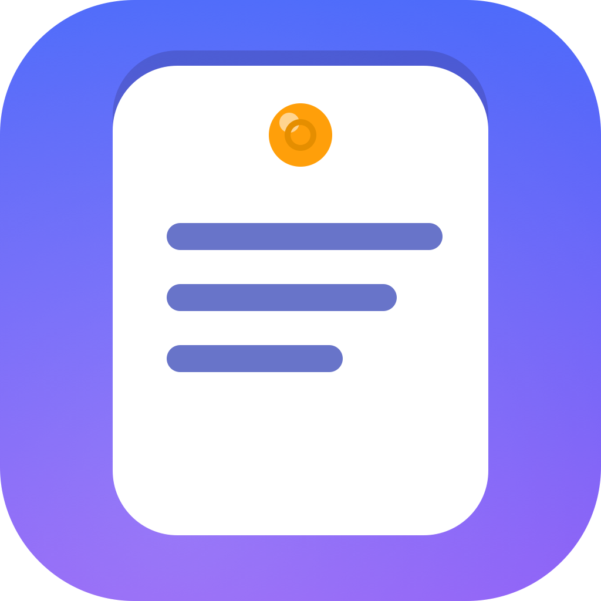

<p align="center">
  
</p>

<h1 align="center">Pocket Drafts</h1>

<p align="center">
  <strong>Fast, private note capture in the macOS menu bar.</strong><br>
  Create, search, tag, pin, and export short notes without leaving what you are doing.
</p>

<p align="center">
  
  
  
  
  
  
</p>

<p align="center">
  <a href="#why-pocket-drafts">Why</a> ·
  <a href="#features">Features</a> ·
  <a href="#privacy">Privacy</a> ·
  <a href="#install">Install</a> ·
  <a href="#usage">Usage</a> ·
  <a href="#keyboard-shortcuts">Shortcuts</a> ·
  <a href="#architecture">Architecture</a> ·
  <a href="#status">Status</a>
</p>

---

## Why Pocket Drafts?

Note apps are often heavy, demand a full window, or quietly sync your text to a cloud. Pocket Drafts lives in the menu bar: one click, type, done. Everything stays on your Mac.

| What you get | Why it matters |
| --- | --- |
| **Instant capture** | Open the popover, press ⌘N, and start typing — no window juggling. |
| **Local-first storage** | Notes and tags live in a SwiftData store inside Application Support. |
| **Native macOS experience** | SwiftUI 6 designed for macOS 15 and later, keyboard-first. |
| **Fast retrieval** | Live search across titles, content, and tags. |
| **Order your drafts** | Pin important notes to the top and categorize with tags. |
| **Plain-text import/export** | Bring in a `.txt` file or export a note through the standard save panel. |
| **No accounts, no cloud, no telemetry** | The app contains no network code at all. |

## Features

| Area | Capability |
|------|-----------|
| Create | New note from the menu bar in seconds with ⌘N |
| Edit | Title, body, pin state, and tags in one compact editor |
| Search | Live case-insensitive filtering of titles, content, and tags |
| Tags | Add and remove tags; chips render inline with an overflow count |
| Pin | Pinned notes sort above the rest; toggle from the row or context menu |
| Delete | Confirmation dialog, then a 10-second undo banner with a live countdown |
| Import | `NSOpenPanel`; a UTF-8 text file becomes a new note |
| Export | `NSSavePanel`; documented UTF-8 header format, written atomically |
| Settings | Relative timestamps and version info (⌘,) |
| Accessibility | VoiceOver labels, keyboard focus, and identifiers on every control |

## Privacy

Pocket Drafts is local-first by design and has **no network code**:

- Notes and tags are stored only in the app's local SwiftData store under Application Support.
- No accounts, no cloud sync, no analytics, no telemetry, and no AI features.
- Files are touched only through the panels you open: import reads exactly the file you pick; export writes only to the path you choose.
- The app requests no system permissions (no contacts, location, camera, or microphone).
- Delete-then-Undo is a 10-second in-memory safety net; once the window passes, the note is gone for good.

## Install

Pocket Drafts is a menu-bar utility: launch it, then click the note icon in the macOS menu bar. The popover opens — there is no main window.

> [!NOTE]
> Local builds are **ad-hoc signed and not Apple-notarized**. On first launch, macOS may ask you to right-click the app and choose **Open**, or approve it in **System Settings → Privacy & Security**.

### Build from source

**Requirements:** macOS 15+, Xcode with the macOS 15 SDK, and [XcodeGen](https://github.com/yonaskolb/XcodeGen) 2.45+.

```bash
git clone https://github.com/nodaysidle/pocket-drafts.git
cd pocket-drafts

xcodegen generate --spec project.yml
xcodebuild -project PocketDrafts.xcodeproj -scheme PocketDrafts -destination 'platform=macOS' build
```

### Install to /Applications

```bash
ditto DerivedData/Build/Products/Debug/PocketDrafts.app /Applications/PocketDrafts.app
open /Applications/PocketDrafts.app
```

## Usage

1. Launch Pocket Drafts and click the note icon in the menu bar.
2. Press **⌘N** and type a title or a few lines.
3. Optionally pin the note or add tags.
4. Press **⌘S** to save; search, open, and export from the list.

Full workflows, accessibility notes, and the manual validation checklist live in [USERGUIDE.md](USERGUIDE.md).

## Keyboard shortcuts

| Action | Shortcut |
| --- | --- |
| New note | <kbd>⌘N</kbd> |
| Save note | <kbd>⌘S</kbd> |
| Delete note while editing | <kbd>⌘⌫</kbd> |
| Cancel / close editor | <kbd>Esc</kbd> |
| Settings | <kbd>⌘,</kbd> |
| Move through controls | <kbd>Tab</kbd> / <kbd>⇧Tab</kbd> |
| Navigate the list | <kbd>↑</kbd> / <kbd>↓</kbd> |

## Architecture

```text
PocketDrafts/
├── PocketDrafts.xcodeproj   # Xcode project (generated from project.yml)
├── PocketDrafts/
│   ├── PocketDraftsApp.swift    # @main; AppKit status item + NSPopover + Settings scene
│   ├── Models/                  # Note, Tag (SwiftData @Model)
│   ├── Views/                   # RootView, DashboardView, NoteEditorView, …
│   ├── Services/                # NoteService, ImportExportService, DeletionUndoService
│   ├── Storage/                 # PersistenceController (ModelContainer)
│   └── Assets.xcassets/         # App icon + menu-bar template icon
├── PocketDraftsTests/           # 22 unit tests
├── project.yml                  # XcodeGen spec
├── PRD.md · ARD.md · TRD.md · TASKS.md · AGENTS.md
└── USERGUIDE.md
```

The popover is a single `RootView` that switches between the note list and the editor. `@Query` feeds in-memory search and filtering, and every mutation flows through `NoteService` into the SwiftData `ModelContext`. Deletion snapshots are owned by the app itself, so the 10-second undo survives popover close and reopen.

The status item is created with AppKit (`NSStatusItem` + `NSPopover`) because SwiftUI's `MenuBarExtra` scene exits immediately inside an LSUIElement app on current macOS builds; the SwiftUI interface itself is hosted unchanged.

## Verification

```bash
xcodebuild -project PocketDrafts.xcodeproj -scheme PocketDrafts -destination 'platform=macOS' build
xcodebuild test -project PocketDrafts.xcodeproj -scheme PocketDrafts -destination 'platform=macOS'
```

22 unit tests cover models, search and filter, tag relationships, pin ordering, delete/undo expiry, and import/export round-trips.

## Documentation

- [USERGUIDE.md](USERGUIDE.md) — workflows, shortcuts, accessibility, manual checklist
- [PRD.md](PRD.md) — product requirements
- [ARD.md](ARD.md) — architecture decisions
- [TRD.md](TRD.md) — technical contracts
- [TASKS.md](TASKS.md) — implementation phases
- [AGENTS.md](AGENTS.md) — execution contract

## Status

| Field | Value |
| --- | --- |
| Status | Active |
| Platform | macOS 15+ |
| Version | 1.0 |
| Stack | Swift 6 · SwiftUI 6 · SwiftData |
| Storage | Local only (Application Support) |

## Contributing

This repository is not currently accepting external contributions.

## License

MIT
